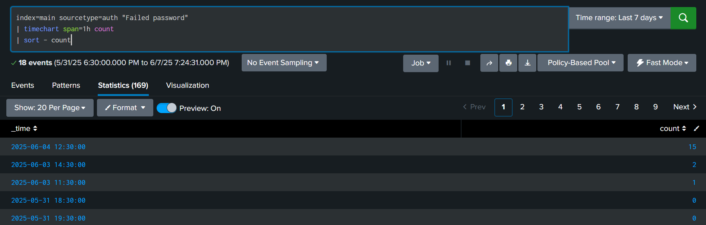
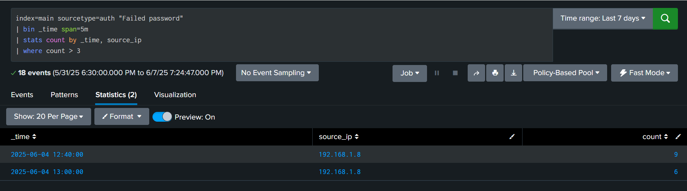
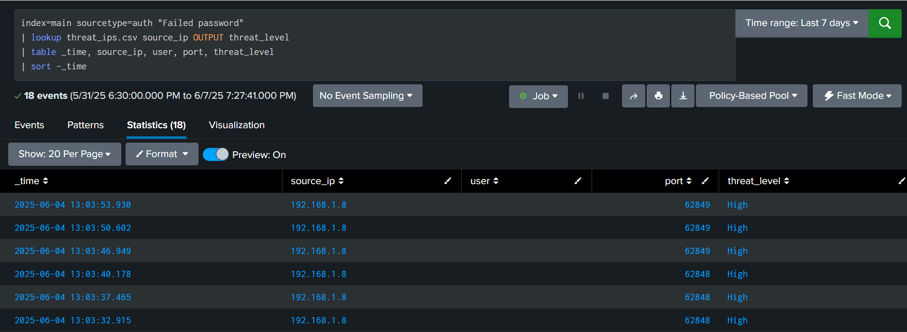

# SIEM-Based Threat Detection & Log Analysis using Splunk Cloud

This project demonstrates how to build a basic Security Information and Event Management (SIEM) setup using Splunk Cloud. It includes log collection, parsing, enrichment, detection logic, dashboards, and alerting — all simulated on a local Ubuntu VM and Splunk Cloud instance.

---

## 🔧 Tools & Technologies

- **Splunk Cloud** – for indexing, searching, and visualizing logs
- **Splunk Universal Forwarder** – for log forwarding
- **Ubuntu VM** – used as a log-generating source (auth.log)
- **VirtualBox** – for virtualization
- **Linux Authentication Logs** – primary data source (`/var/log/auth.log`)

---

## 🧠 What This Project Covers

- Log forwarding from Ubuntu VM to Splunk Cloud
- Field extractions from raw syslog data
- Lookup-based threat intelligence enrichment
- Dashboards to visualize login attempts
- Real-time alerts for brute-force detection

---

## 🛠️ Key Features Implemented

- ✅ Configured Splunk Universal Forwarder to send `/var/log/auth.log` to Splunk Cloud (TCP 9997)
- ✅ Field extractions for `user`, `port`, `source_ip`, etc.
- ✅ Custom dashboard panels for failed login attempts
- ✅ Scheduled alert for brute-force login detection
- ✅ CSV-based threat enrichment using `threat_ips.csv`
- ✅ Alerting on matches from known bad IPs

---

## 📊 Dashboard Panels

- Top attacked usernames
- Ports targeted in failed logins
- Source IPs involved in failed SSH attempts

---

## ⚠️ Alert Setup

- Trigger: >3 failed login attempts from the same IP
- Frequency: Hourly
- Action: Notify with alert on Splunk Cloud

---

## 📸 Screenshots

## 📊 Sample Dashboard

This panel visualizes failed SSH login attempts by username.

---

## ⚠️ Brute Force Alert Triggered

This alert was configured to detect more than 3 failed logins from the same IP.

---

## 🔐 Threat Lookup Match

Enrichment using a `threat_ips.csv` lookup table to detect suspicious IPs.

---

## 📌 Future Enhancements

- GeoIP mapping of public IPs
- Additional log sources (e.g., Apache, system logs)
- Correlation between multiple logs

---

## 🙋‍♂️ Author

**Bhavya Karia**  
Cybersecurity Enthusiast | SOC Analyst (Fresher)

---
